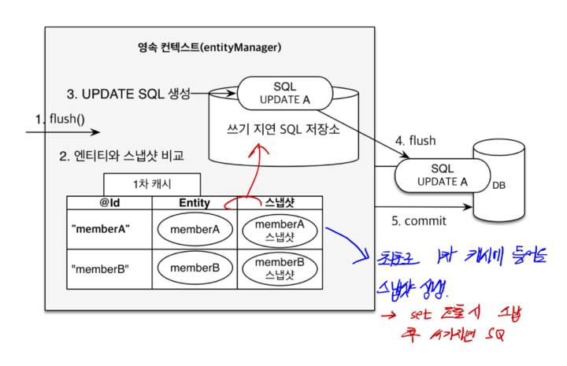

## @Transactional(readonly = true) ?
* 스프링을 사용해서 개발을 하게 되면 필연적으로 사용하게 되는 어노테이션이다.
* 여태까지는 롤백, 동일성 보장 , 변경감지의 기능을 필요로 할 때만 사용 했는데,
* readOnly 옵션에 대해서 정리해 보겠다.

 

readOnly = true 옵션을 조회용 메서드에 사용하게 되면 성능상의 이점 및 부가적인 장점을 가지게 된다고 한다.

### 왜 ?

* 이유는 JPA의 영속성과 밀접한 관련이 있는데, 영속성 컨텍스트의 형태는 위 처럼 1차캐시 , 스냅샷의 구조로 되어있다. 
* 스냅샷은 1차캐시에 존재하는 엔티티의 정보와 비교해서 변경 된 점이 있다면 업데이트 쿼리를 DB에 날리게 된다.(변경감지)
* 이 때 readOnly = true 옵션을 적용 해주게 된다면, JPA의 세션 플러시 모드를 MANUAL로 설정하게 된다.
    * MANUAL 모드는 트랜잭션 내에서 사용자가 수동으로 flush를 호출하지 않으면 flush가 자동으로 수행되지 않는 모드이다.
*  이에 따라 수동으로 flush를 호출하지 않는 한 수정이 되지 않으므로, 
* 단순 조회용 메서드에 선언 해주게 된다면 가독성과 예상치 못한 수정에 대해서 대비할 수 있다.

* 또한, readOnly = true 옵션이 붙은 트랜잭션 내에서는 JPA가 조회용임을 인식하고 스냅샷을 따로 생성하지 않게 된다.
* 이에따라 메모리가 절약되어 성능상의 이점도 가져올 수 있다.

* 추가적으로 규모가 커지게 된다면, 읽기전용 DB를 구성해 사용하는 방법과 관련된 부분도 존재 하지만 
* 다른 포스팅에서 따로 다루도록 하겠다.